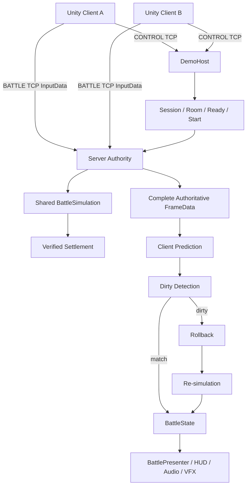
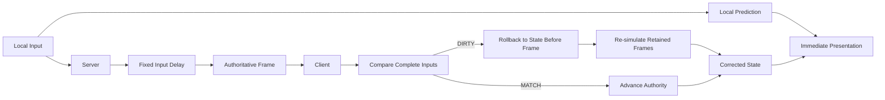
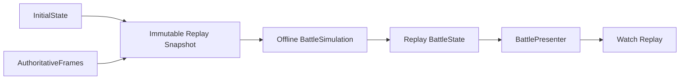

# Architecture

## Runtime ownership

Two Unity clients share a pure C# simulation with a .NET server. Presentation never decides damage, collisions, projectile lifetime, round results, or settlement.

| Owner | Responsibility |
| --- | --- |
| DemoHost / CONTROL | Sessions, nickname, rooms, ready/start, battle attachment, verified settlement, and return to lobby. |
| Server authority / BATTLE | Input admission, fixed delay, complete frame ordering, and authoritative simulation. |
| Shared BattleSimulation | Integer movement, obstacles, projectile collisions, HP, countdowns, round/match rules. |
| Client prediction timeline | Bounded predicted state, complete-input comparison, dirty detection, rollback/re-simulation. |
| Unity presentation | Mouse projection, model facing, animation, HUD, VFX/audio, diagnostics, and offline replay controls. |

## One tick

Simulation tick rate is 30 Hz. Local prediction input generation is paced at that rate; network pumping remains in per-render Update. Default input delay is two ticks, and the future-input/prediction window is eight ticks. The server publishes only complete frames; missing input is not silently replaced.

State coordinates use integer simulation units; Unity presentation converts 1,000 units to one world unit. Aim is a canonical quantized direction. Shared deterministic collision, not Unity Physics, owns obstacle and player hits. Scene art is manually aligned with the canonical arena definition.

## Replay

The client verifies settlement and retains the initial state and authoritative frames before disposing the live battle runtime. Watch Replay starts a fresh simulation without a BATTLE socket or prediction timeline. It feeds one frame per tick and presents the resulting state through the same scene. CONTROL remains available for the settlement/lobby lifecycle.

## Consistency checks

StateDigest hashes canonical gameplay state, including tick, roster, players, projectiles, and match state. It is a deterministic consistency check, not cryptographic protection. Comparing authority and prediction at different ticks is not a desync test; F1 displays N/A for that comparison. Settlement verification includes authoritative replay convergence.

Transient feedback has presentation-local identity caches. A full presentation reset clears those caches and owned effects when switching between live/result/replay. It does not mutate simulation state. Removed projectiles without per-ID authoritative hit attribution get neutral/environment feedback; unrelated HP changes do not imply that every removed projectile hit a player.

## Source dependency boundaries

- `Server.DemoHost` depends on server LiveTcp, ProtocolAuthority, FrameSync, and the shared simulation/protocol/framing projects through actual project references.
- Client live TCP composes prediction, protocol, stream framing, and simulation. The demo client adds the CONTROL business flow.
- Unity runtime consumes those shared packages and provides scene/prefab presentation. The offline replay player uses the same `BattleSimulation` source.
- Build output includes the self-contained .NET server beside the Unity Player. Ordinary players need no SDK.

Unity scene, prefab, material, texture, shader, Resources, and script references are GUID-sensitive. A portable source copy must retain the actual dependency closure and matching `.meta` files, not just objects visible in the arena.

See [Replay and Rollback](REPLAY_AND_ROLLBACK.md), [Testing](TESTING.md), and [Quick Start](QUICK_START.md).
