# Lockstep Arena v1 Architecture

## Purpose

v1 proves one complete two-client loopback TCP business flow while keeping simulation determinism, authority, prediction, transport, and presentation ownership explicit. Gate 14 composes the frozen Gate 3–13 components; it does not create a second simulation, authority, prediction, framing, or networking stack.

## Data flow

```mermaid
flowchart LR
    UI[Unity Debug Client] -->|nickname / room commands| CP[CONTROL TCP pump]
    CP --> CFP[Length-prefixed framing]
    CFP --> HOST[DemoHost sessions and rooms]
    HOST -->|freeze join order| ROSTER[ActiveRoster and bootstrap]
    ROSTER --> TICKET[one-time battle ticket]
    TICKET --> BP[BATTLE TCP attachment]
    BP --> SHARED[Gate 13 TcpSharedBattleSession]
    UI --> PRED[Gate 13 PredictedTcpClientBattleRuntime]
    PRED -->|local InputFrame| SHARED
    CLOCK[Stopwatch pacing and fixed InputDelay] --> SHARED
    SHARED --> AUTH[authoritative FrameData]
    AUTH --> PRED
    PRED -->|clean or Dirty rollback/replay| STATE[authoritative and predicted state]
    SHARED --> SETTLE[Tick-limit settlement]
    STATE --> SETTLE
    SETTLE -->|verified final state and digest| UI
    UI -->|ReturnToLobby / Exit| HOST
```



## Ownership boundaries

| Boundary | Owner | Does not own |
|---|---|---|
| Deterministic rules, roster, complete `FrameData`, state digest | `LockstepArena.Simulation` | wall clock, TCP, Protobuf, prediction |
| Protobuf DTO mapping | `LockstepArena.Protocol` | state storage, authority, framing |
| Length-prefix encode/decode | `LockstepArena.StreamFraming` | message types or routing |
| Per-Tick collection, InputDelay eligibility, Stopwatch pacing | Server FrameSync / ProtocolAuthority | room lifecycle or client prediction |
| Shared participant battle sockets and authority broadcast | Gate 13 Server LiveTcp | lobby/control business rules |
| Prediction, Dirty comparison, rollback/re-simulation, Replay | Gate 12/13 client runtime | authoritative publication |
| Nicknames, sessions, rooms, ready/start, tickets, settlement | Gate 14 DemoHost | duplicate networking or simulation rules |
| Debug controls and immutable diagnostics | Gate 14 Unity/Client Demo | gameplay rendering or prediction policy |

## Session, room, and battle lifecycle

```text
AwaitingNickname -> Lobby -> InRoom -> PreparingBattle -> InBattle
                 -> Settlement -> Lobby or Closed

Open -> PreparingBattle -> InBattle -> Settled -> Removed
```

Sessions and rooms are process-local and bounded by explicit options. A room host chooses capacity within the server limit. Stable join order freezes continuous `PlayerSlot` values; `SessionId` becomes the battle `PlayerId` but never determines execution order. All participants must be present and Ready before host Start. Ticketed BATTLE sockets are separate from persistent CONTROL sockets.

## Deterministic v1 Golden

Bravo enters first as PlayerId 1. Alpha enters second, creates Room 1, and becomes PlayerId 2. Join order freezes Alpha at Slot 0 and Bravo at Slot 1. The battle starts at Tick 0, uses InputDelay 2, accepts inputs through Tick 3, and settles at State Tick 4.

```text
Initial  D08BA63E403C71AF
State 1  F82D3BE4A98024B5
State 2  A4DAA5FBE7E940ED
State 3  7A653646579E6AEC
State 4  D8E54FF828A4C670
```

Both clients predict four frames before authority. Their unknown remote input is initially neutral, so every authoritative reconciliation is Dirty. Both then rollback/re-simulate and converge with the server and authoritative Replay at State Tick 4.

## Runtime and verification entry points

- Server: `dotnet run --project Server/LockstepArena.Server.DemoHost/LockstepArena.Server.DemoHost.csproj -c Release`
- Unity scene: `Assets/LockstepArenaDemo/Scenes/LockstepArenaDemo.unity`
- Gate 14 .NET proof: `dotnet run --project Tests/LockstepArena.DemoFlow.Tests/LockstepArena.DemoFlow.Tests.csproj -c Release`
- Full detailed matrix: `Docs/Architecture/GATE14_MINIMAL_TCP_LOBBY_TO_BATTLE_DEMO.md`

## v1 limitations and exclusions

The transport is IPv4 loopback TCP only. CONTROL and BATTLE are separated by connection purpose but there is no opcode/router framework. v1 has no MySQL or persistent accounts, registration/passwords, chat, matchmaking system, public/LAN deployment, TLS, KCP/UDP, reconnect, heartbeat, adaptive InputDelay, timeout/neutral/repeat-last policy, interpolation, new Snapshot system, combat, ECS, cluster, generic transport abstraction, DI, or EventBus. Gate 14 is the final v1 Gate; no Gate 15 is defined.
