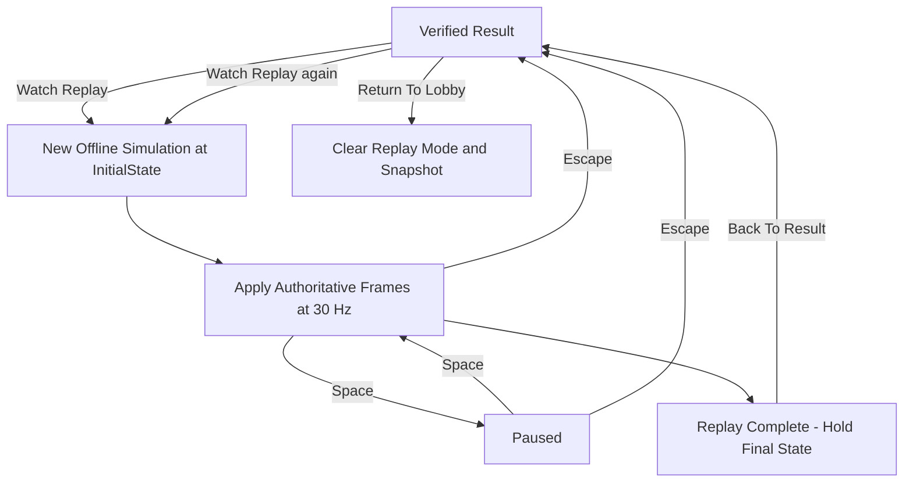

# Replay and Rollback

These are different uses of the same deterministic simulation.

| | Live rollback | Watch Replay |
| --- | --- | --- |
| Inputs | Authoritative frame plus retained predicted frames | Retained authoritative frames only |
| State source | Bounded client prediction timeline | Fresh offline BattleSimulation |
| Network | Live CONTROL and BATTLE | No BATTLE input/socket; settlement CONTROL remains available |
| Purpose | Correct a dirty prediction | Reproduce the verified match for viewing |

## Prediction and dirty frames

The client predicts from complete frames and retains the state before each prediction. Local input is sampled at 30 Hz. Before reconciliation provides remote input, a neutral remote input is used; afterward the most recently reconciled remote input is reused for prediction.

Authority cannot be ahead of the predicted timeline, and prediction is bounded to eight ticks. Reconciliation compares every input field in the complete authoritative frame with its prediction. Even if different inputs happen to produce the same clamped position, the frame is dirty.

For matching input, advance authority. For dirty input:

1. Restore the state before that frame.
2. Step the authoritative frame through shared simulation.
3. Re-simulate the remaining retained predicted frames.
4. Present the corrected predicted state.

Invalid ordering or bounds fail explicitly rather than inventing inputs. `LatestDirty` describes the most recent reconciliation; the cumulative dirty-frame count counts rollback-triggering frames, not visual animation corrections.

## Snapshot retention

Settlement must be verified before replay can be offered. The replay snapshot contains the original initial state and a defensive, read-only copy of the authoritative frame sequence. It remains usable after the live battle runtime is disposed.

No verified settlement, no snapshot, or an empty frame sequence means no Watch Replay action. Returning to lobby, aborting, exiting the client, or starting a new battle invalidates the retained replay lifecycle.

## Playback lifecycle

The player does not sample movement/aim/fire input during replay. SPACE and ESC are replay UI actions, not gameplay commands. End-of-replay holds the last state; it neither disconnects the valid settlement connection nor automatically returns to lobby.

A second replay starts from the initial state. Full presenter reset clears projectile identity caches, HP-hit dedupe, announcements, and owned audio/VFX objects, so the same IDs can produce feedback again. Returning to result preserves separate Watch Replay and Return To Lobby actions. A new real match has no leftover replay mode.

## Timing and verification

One playback tick applies one authoritative frame. At normal render rates, elapsed-time pacing follows `SimulationConfig.TickRate = 30`; at most one frame is consumed per render update so transient presentation is not skipped. Below 30 render FPS, playback slows.

Final replay tick and StateDigest must match the verified authoritative endpoint. The existing final predicted display state can be ahead of authority and is not the endpoint used for this comparison.

Replay is memory-only. It has no seek, speed control, free camera, disk export, or alternative collision authority. See [Testing](TESTING.md) for runnable regression coverage.
