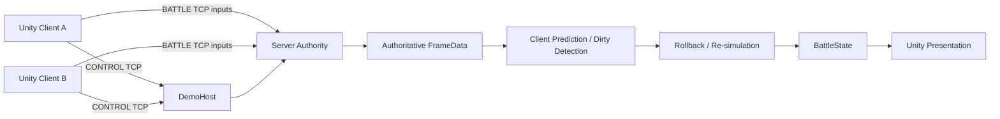

# Lockstep Arena

Deterministic 1v1 Multiplayer Arena

Unity 6 · C# · Server Authority · Input Lockstep · Client Prediction · Rollback / Re-simulation · Authoritative Replay · StateDigest

## What is Lockstep Arena?

A playable LAN arena and a small, inspectable multiplayer implementation. Two players create/join a room, ready up, and fight a first-to-two-wins match. A verified match can be replayed from authoritative inputs through the same deterministic simulation—not from recorded video or transforms.

## Core technical features

| Feature | Implementation |
| --- | --- |
| Deterministic simulation | Shared C# simulation with integer state and explicit complete input frames; no Unity Physics authority. |
| Server-authoritative input lockstep | CONTROL TCP handles rooms; BATTLE TCP collects inputs and publishes complete authoritative frames. |
| Client prediction | Local input advances a bounded prediction timeline for responsive presentation. |
| Dirty detection and rollback | Compare predicted and authoritative inputs, restore state before a dirty frame, and re-simulate retained frames. |
| StateDigest | Canonical state hashing supports same-tick comparison and final settlement/replay verification. |
| Authoritative replay | Retain initial state plus authoritative frames; replay offline with pause, resume, repeat, and return to result. |

## Architecture



The server owns the input timeline and settlement. Shared simulation owns combat and collision. Unity owns input sampling, rendering, audio, and UI. See [Architecture](Docs/ARCHITECTURE.md) for the tick and replay flows.

## Client prediction and rollback

Local prediction runs at 30 simulation ticks per second, independently of per-render network pumping. Prediction is bounded to eight ticks, matching the server's future-input window. Remote prediction uses the latest reconciled input, or neutral input before one is available.

Reconciliation compares complete frame inputs, not just positions. A dirty frame restores its preceding state and re-simulates the remaining retained predictions. F1 exposes authoritative/predicted ticks, pending frames, dirty-frame counts, and digests. Digest equality is meaningful only at the same tick.

## Authoritative replay

Verified settlement retains an immutable snapshot of the initial state and authoritative frames before releasing the battle runtime. **Watch Replay** creates a fresh offline simulation and reuses the battle presenter. Gameplay input is suppressed; the settlement CONTROL connection remains available.

Space pauses/resumes. Escape returns to the same result. Completed replay remains visible until **Back To Result** is selected. Watching again resets projectile identities, HP feedback, announcements, and owned transient effects. Returning to lobby clears replay mode and the retained snapshot.

Details: [Replay and Rollback](Docs/REPLAY_AND_ROLLBACK.md).

## Gameplay flow

Main Menu → Create/Join LAN → Lobby → Room → Ready → Host Start → Battle → Verified Result → Watch Replay or Return To Lobby.

- WASD moves, mouse aims, held left mouse fires; F1 toggles diagnostics.
- Players start with 100 HP; a hit deals 25 damage.
- Each round has a three-second countdown and a 60-second fight timer.
- First player to two round wins takes the match; drawn rounds do not count as wins.

## Windows demo

Copy the entire `LockstepArena-Windows-x64` folder, not just the executable. The packaged server is self-contained; players do not need Unity, Visual Studio, or the .NET SDK.

1. Host launches `LockstepArena.exe`, chooses **Create LAN**, enters a nickname and room name, and creates a room. The application starts its bundled DemoHost.
2. Guest launches another copy, chooses **Join LAN**, enters a different nickname and the host's IPv4 address, selects the room, and joins.
3. Both players select **Ready**; the host selects **Start**.

For two players on one PC, use `127.0.0.1`. For two PCs, use the host's active LAN IPv4 address. Allow Private Network access if Windows Firewall asks. TCP ports 46000 (CONTROL) and 46001 (BATTLE) must be available on the host. This is a private-LAN demo, not a public Internet service.

See [Quick Start](Docs/QUICK_START.md) for troubleshooting.

## Build from source

- Unity `6000.3.10f1` (Unity 6.3 LTS), with Windows build support.
- .NET SDK `8.0.419`, as pinned in `global.json`.

Open the project in Unity and open `Assets/LockstepArenaDemo/Scenes/LobbyScene.unity`. Close all running game clients, then select **Lockstep Arena → Build v3-A Windows Player**. The existing menu name is retained; it builds the current saved Lobby/Battle scenes and publishes the current self-contained server.

The complete output is `.artifacts/V3APlayer/`. Launch `LockstepArena.exe` from that folder. Do not regenerate the battle presentation assets to build: the saved scene and robot prefab contain authored adjustments.

## Tests

```powershell
dotnet run --project Tests/LockstepArena.Simulation.Tests/LockstepArena.Simulation.Tests.csproj -c Release
dotnet run --project Tests/LockstepArena.DemoFlow.Tests/LockstepArena.DemoFlow.Tests.csproj -c Release
dotnet run --project Tests/LockstepArena.Client.Prediction.Tests/LockstepArena.Client.Prediction.Tests.csproj -c Release
dotnet run --project Tests/LockstepArena.LivePrediction.Tests/LockstepArena.LivePrediction.Tests.csproj -c Release
```

Run these serially. In Unity, open Test Runner, clear its search field, choose **EditMode → Run All**. Test contracts and manual acceptance are documented in [Testing](Docs/TESTING.md).

## Project structure

| Directory | Purpose |
| --- | --- |
| `Packages/com.locksteparena.*` | Shared simulation, protocol, framing, prediction, live TCP client, and demo client flow. |
| `Server/` | DemoHost and its authority/transport dependencies. |
| `Assets/LockstepArenaDemo/` | Saved scenes, presentation prefabs, shell, HUD, replay player, and Unity tests. |
| `Assets/Art/` | Selected presentation assets. |
| `Tests/` | Runnable .NET regression suites. |
| `Docs/` | Architecture, replay/rollback, testing, quick start, and real gameplay media. |

## Known limitations

- One fixed 1v1 arena. Deterministic rectangular obstacles are defined in shared simulation; scene meshes and Unity Colliders do not author gameplay collision. Visual alignment is manual.
- TCP, fixed input delay, and strict complete frames. A missing player's input stalls authority; no missing-input substitution or reconnect.
- No accounts, Internet matchmaking, TLS, or public-service hardening.
- Slight remote visual jitter remains; no interpolation layer.
- Replay is in memory only, with no seek, speed control, or disk format. Below 30 render FPS, playback slows rather than skipping presentation frames.
- StateDigest is a consistency check, not a cryptographic anti-cheat mechanism.
- Projectile removal lacks authoritative per-ID hit attribution; uncertain removals use neutral/environment feedback rather than claiming a player impact. HP decrease feedback is separate.

## Third-party assets and licenses

Robot: [Styloo](https://styloo.itch.io/robot-character). Arena/props/weapons: [Quaternius](https://quaternius.com/). UI, particles, and audio: [Kenney](https://kenney.nl/). The selected art packs use CC0. Embedded Liberation Sans uses SIL OFL 1.1; Google.Protobuf uses BSD-3-Clause. Installed Windows fonts are used at runtime, not redistributed.

See [Third-party licenses](THIRD_PARTY_LICENSES.txt) and the notices included with the Windows package. Asset licenses do not grant a license to unrelated project code.

## Engineering docs

- [Architecture](Docs/ARCHITECTURE.md)
- [Replay and Rollback](Docs/REPLAY_AND_ROLLBACK.md)
- [Testing](Docs/TESTING.md)
- [Quick Start](Docs/QUICK_START.md)
